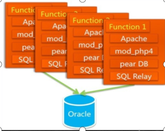
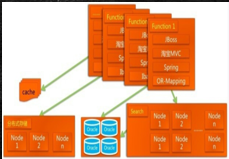

单体项目---》微服务---》服务网格。

上班。


# 意识

1. 好 技术和架构，都是 演化来的。杜绝过度设计。

   先有，后优化。（随着你工作经验的积累，会在有的阶段做优化的事）。

2. 好的设计图，架构图，业务逻辑图，时序图 等，充满美感。

   




 3. 有时候看上去没做什么，但有些东西已经在不知不觉形成了。

 4. 好多牛X的人，都是不断发现自己是傻X的过程。

    不知道自己不知道，才可怕。

    4. 自己思考之后，再问。（不知道答案的时候，不要问。）。

    5. 依赖了别人，就是放弃了自己。404。

    6. 独立思考。

    ```
    我们只是毫无歉意地敌视那些提问前不愿思考、不做好准备的人。这种人就像时间无底洞一样──只知道索取，不愿意付出，他们浪费了时间，这些时间本可用于其它更有趣的问题或更值得回答的人。我们将这种人叫做 “失败者（loser）”
    ```

    

# 规范

程序员有50%时间，在命名上。


# 工程结构

```xml
父项目
----子项目
----子项目

pom.xml
```


```xml
msb-dongbao-mall-parent        	父项目
--msb-dongbao-mall-application 	入口（controller）
--msb-dongbao-mall-api			接口（controller调用api）
	--msb-dongbao-cms-api
	--msb-dongbao-cart-api		购物车api代码
    --msb-dongbao-pms-api		商品中心api代码
	--msb-dongbao-dictionary-api
	--msb-dongbao-oms-api
	--msb-dongbao-pay-api
	--msb-dongbao-sms-api
	--msb-dongbao-ums-api

--msb-dongbao-mall-service		接口的实现层(api的实现层)
	--xxxx项目
--msb-dongbao-mall-common		通用工具类
pom.xml
```


```
代码模块介绍
msb-dongbao-mall-parent        	父项目
	msb-dongbao-common 公共包
		msb-dongbao-common-base 公共基础类
		msb-dongbao-common-util 工具类
	msb-dongbao-api 业务模块接口层
		msb-dongbao-oms-api 订单中心接口
		msb-dongbao-pms-api 商品中心接口
		msb-dongbao-ums-api 用户中心接口
		msb-dongbao-pay-api 支付中心接口
		msb-dongbao-cart-api 购物车接口
		msb-dongbao-dictionary-api 基础字典接口
		msb-dongbao-sms-api 优惠中心接口
		msb-dongbao-cms-api 内容中心接口
	msb-dongbao-service 业务模块实现层
		msb-dongbao-oms 订单中心模块实现
		msb-dongbao-pms 商品中心模块实现
		msb-dongbao-ums 用户中心模块实现
		msb-dongbao-pay 支付中心模块实现
		msb-dongbao-cart 购物车模块实现
		msb-dongbao-dictionary 基础字典模块实现
		msb-dongbao-sms 优惠中心模块实现
		msb-dongbao-cms 内容中心模块实现
	msb-dongbao-application web应用模块

	    msb-dongbao-manager-web 后台管理应用
		msb-dongbao-portal-web 商城门户网站
	msb-dongbao-job 定时任务模块

	msb-dongbao-generator 代码生成器
```


项目：msb-dongbao-oms-api编译后msb-dongbao-oms-api.jar


A项目，pom文件中写上msb-dongbao-oms-api.jar的坐标。


第三层才是核心代码编写的地方


# 作业

搭建完项目架构。


# git地址

https://gitee.com/cpf100/msb-dongbao-mall