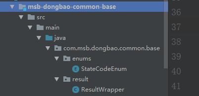

# 项目结构

spring boot项目  就是 maven项目。


# 统一返回值

## 前后端分离，后端接口，一般：

```json
{
    "code":状态码, 
    "msg":"信息提示",
    "data": T   
    
}
data:object  或者  list
```


在msb-dongbao-common-base中定义：



统一定义 公司的返回值。


把 base 的坐标放到了service中。


便于状态码统一管理，便于前端统一处理。


# 参数校验


当你有拷贝欲望的时候，就得考虑是你是不是做错了。是不是有更好的办法。


# 统一异常处理

1. 在 controller 制造一个  除零 异常。

2. ```java
   package com.msb.dongbao.portal.web.advice;
   
   import com.msb.dongbao.common.base.result.ResultWrapper;
   import org.springframework.web.bind.annotation.*;
   
   /**
    * @author 马士兵教育:chaopengfei
    * @date 2021/1/12
    */
   @RestControllerAdvice
   public class GlobalExceptionHandle {
   
   	@ExceptionHandler(Exception.class)
   	public ResultWrapper customException(){
   		return ResultWrapper.builder().code(301).msg("统一异常").build();
   	}
   }
   
   ```

   


