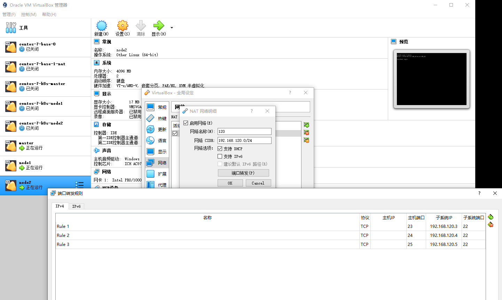

# vmbox

VirtualBox-5.2.22-126460-Win.exe

CentOS-7-x86_64-DVD-1810.iso


最小服务器


## 网络模式

桥接模式：虚拟机和主机在同一个局域网中，占用局域网IP。

NAT模式：通过服务网络转发，不占用局域网IP，端口映射，建议大家用这种方式。

两种都可以。

# 全局设定

## 网络


## 端口转发

## 设置nat网络，配置端口




## IP分配


192.168.120.0-24


master：192.168.120.3

node1:192.168.120.4

node2:192.168.120.5


# 固定IP

网桥：弃用。

```sh
[root@k8smaster tomcat-service]# cd /etc/sysconfig/network-scripts/
[root@k8smaster network-scripts]# ls
ifcfg-enp0s3  ifdown-ippp  ifdown-routes    ifup          ifup-ipv6   ifup-ppp       ifup-tunnel
ifcfg-lo      ifdown-ipv6  ifdown-sit       ifup-aliases  ifup-isdn   ifup-routes    ifup-wireless
ifdown        ifdown-isdn  ifdown-Team      ifup-bnep     ifup-plip   ifup-sit       init.ipv6-global
ifdown-bnep   ifdown-post  ifdown-TeamPort  ifup-eth      ifup-plusb  ifup-Team      network-functions
ifdown-eth    ifdown-ppp   ifdown-tunnel    ifup-ippp     ifup-post   ifup-TeamPort  network-functions-ipv6
[root@k8smaster network-scripts]# pwd
/etc/sysconfig/network-scripts
[root@k8smaster network-scripts]# cat ifcfg-enp0s3 
TYPE="Ethernet"
PROXY_METHOD="none"
BROWSER_ONLY="no"
#修改部分开始
#BOOTPROTO="dhcp"
BOOTPROTO="static"
IPADDR=192.168.110.201
NETMASK=255.255.255.0
GATEWAY=192.168.110.1
DNS1=114.114.114.114
#修改部分结束


DEFROUTE="yes"
IPV4_FAILURE_FATAL="no"
IPV6INIT="yes"
IPV6_AUTOCONF="yes"
IPV6_DEFROUTE="yes"
IPV6_FAILURE_FATAL="no"
IPV6_ADDR_GEN_MODE="stable-privacy"
NAME="enp0s3"
UUID="5e89498f-6eac-4161-bedf-c6d721e04b23"
DEVICE="enp0s3"
ONBOOT="yes"
[root@k8smaster network-scripts]# systemctl restart network
```


NAT:

```sh
[root@localhost ~]# cat /etc/sysconfig/network-scripts/ifcfg-enp0s3
TYPE="Ethernet"
PROXY_METHOD="none"
BROWSER_ONLY="no"

BOOTPROTO="static"
IPADDR=192.168.120.3
NETMASK=255.255.255.0
GATEWAY=192.168.120.2
DNS1=114.114.114.114

DEFROUTE="yes":
IPV4_FAILURE_FATAL="no"
IPV6INIT="yes"
IPV6_AUTOCONF="yes"
IPV6_DEFROUTE="yes"
IPV6_FAILURE_FATAL="no"
IPV6_ADDR_GEN_MODE="stable-privacy"
NAME="enp0s3"
UUID="5e89498f-6eac-4161-bedf-c6d721e04b23"
DEVICE="enp0s3"
ONBOOT="yes"
[root@localhost ~]# 


[root@localhost network-scripts]# cat ifcfg-enp0s3 
TYPE="Ethernet"
PROXY_METHOD="none"
BROWSER_ONLY="no"
# 开始
BOOTPROTO="static"
IPADDR=192.168.120.4
NETMASK=255.255.255.0
GATEWAY=192.168.120.2
DNS1=114.114.114.114
# 结束
DEFROUTE="yes"
IPV4_FAILURE_FATAL="no"
IPV6INIT="yes"
IPV6_AUTOCONF="yes"
IPV6_DEFROUTE="yes"
IPV6_FAILURE_FATAL="no"
IPV6_ADDR_GEN_MODE="stable-privacy"
NAME="enp0s3"
UUID="5e89498f-6eac-4161-bedf-c6d721e04b23"
DEVICE="enp0s3"
ONBOOT="yes"
[root@localhost network-scripts]# 


[root@localhost network-scripts]# cat ifcfg-enp0s3 
TYPE="Ethernet"
PROXY_METHOD="none"
BROWSER_ONLY="no"
#开始
BOOTPROTO="static"
IPADDR=192.168.120.5
NETMASK=255.255.255.0
GATEWAY=192.168.120.2
DNS1=114.114.114.114
#结束
DEFROUTE="yes"
IPV4_FAILURE_FATAL="no"
IPV6INIT="yes"
IPV6_AUTOCONF="yes"
IPV6_DEFROUTE="yes"
IPV6_FAILURE_FATAL="no"
IPV6_ADDR_GEN_MODE="stable-privacy"
NAME="enp0s3"
UUID="5e89498f-6eac-4161-bedf-c6d721e04b23"
DEVICE="enp0s3"
ONBOOT="yes"
[root@localhost network-scripts]# 
```


## 查询网关：

```sh
[root@localhost network-scripts]# netstat -rn
Kernel IP routing table
Destination     Gateway         Genmask         Flags   MSS Window  irtt Iface
0.0.0.0         192.168.120.2   0.0.0.0         UG        0 0          0 enp0s3
192.168.120.0   0.0.0.0         255.255.255.0   U         0 0          0 enp0s3
[root@localhost network-scripts]# 
```


## 重启网络


service network restart

