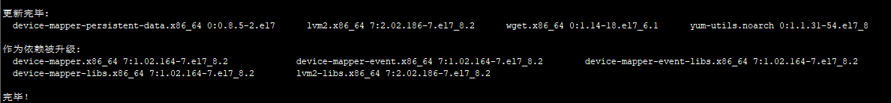
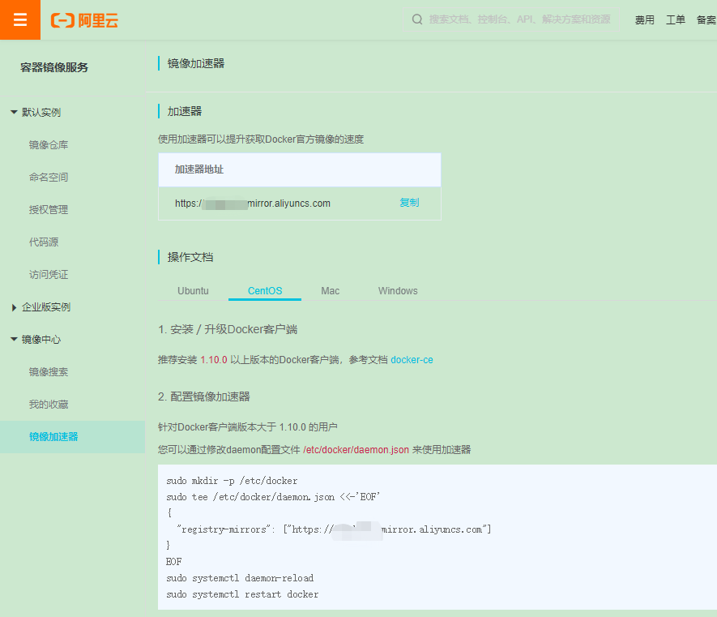
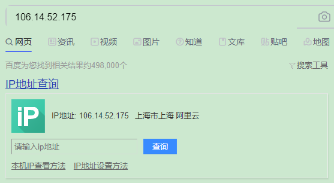

```html
docker教程：
https://www.runoob.com/docker/docker-tutorial.html
```


# 卸载docker

较旧的 Docker 版本称为 docker 或 docker-engine 。如果已安装这些程序，请卸载它们以及相关的依赖项。


```sh
yum remove docker docker-client docker-client-latest docker-common docker-latest docker-latest-logrotate docker-logrotate docker-selinux docker-engine-selinux docker-engine


```

# 安装依赖

```sh
yum install -y yum-utils device-mapper-persistent-data lvm2 wget
```

yum-utils:yum包管理工具。提供一下yum相关的工具命令。

在新主机首次安装 Docker Engine-Community之前，需要设置Docker仓库，之后，您可以从仓库安装和更新 Docker。

设置仓库，需要安装所需的软件包。yum-utils 提供了 yum-config-manager ，并且 device mapper 存储驱动程序需要 device-mapper-persistent-data 和 lvm2。

device mapper
Device Mapper 是 Linux2.6 内核中支持逻辑卷管理的通用设备映射机制，它为实现用于存储资源管理的块设备驱动提供了一个高度模块化的内核架构。

LVM
LVM（Logical Volume Manager）逻辑卷管理。

它是对磁盘分区进行管理的一种机制，建立在硬盘和分区之上的一个逻辑层，用来提高磁盘管理的灵活性。通过LVM可将若干个磁盘分区连接为一个整块的卷组(Volume Group)，形成一个存储池。可以在卷组上随意创建逻辑卷(Logical Volumes)，并进一步在逻辑卷上创建文件系统，与直接使用物理存储在管理上相比，提供了更好灵活性。

device-mapper-persistent-data 和 lvm2
两者都是Device Mapper所需要的。


yum-utils: yum管理工具。提供了yum-config-manager.

device-mapper-persistent-data  和 lvm2 提供了磁盘管理相关的工具。

wget下载文件的工具。





# 下载repo源文件

```sh
查看一下源文件。

就是一个yum源的配置文件夹，yum如果想能用， 必须放在/etc/yum.repos.d的文件夹下，才能生效，yum配置文件必须.repo结尾的


[root@localhost ~]# cd /etc/yum.repos.d/
[root@localhost yum.repos.d]# ll
总用量 32
-rw-r--r--. 1 root root 1664 11月 23 2018 CentOS-Base.repo
-rw-r--r--. 1 root root 1309 11月 23 2018 CentOS-CR.repo
-rw-r--r--. 1 root root  649 11月 23 2018 CentOS-Debuginfo.repo
-rw-r--r--. 1 root root  314 11月 23 2018 CentOS-fasttrack.repo
-rw-r--r--. 1 root root  630 11月 23 2018 CentOS-Media.repo
-rw-r--r--. 1 root root 1331 11月 23 2018 CentOS-Sources.repo
-rw-r--r--. 1 root root 5701 11月 23 2018 CentOS-Vault.repo
[root@localhost yum.repos.d]# wget -O /etc/yum.repos.d/docker-ce.repo https://download.docker.com/linux/centos/docker-ce.repo
--2020-10-11 19:16:39--  https://download.docker.com/linux/centos/docker-ce.repo
正在解析主机 download.docker.com (download.docker.com)... 13.35.121.23, 13.35.121.111, 13.35.121.10, ...
正在连接 download.docker.com (download.docker.com)|13.35.121.23|:443... 已连接。
已发出 HTTP 请求，正在等待回应... 200 OK
长度：1919 (1.9K) [binary/octet-stream]
正在保存至: “/etc/yum.repos.d/docker-ce.repo”

100%[================================================================================================================================>] 1,919       7.30KB/s 用时 0.3s   

2020-10-11 19:16:41 (7.30 KB/s) - 已保存 “/etc/yum.repos.d/docker-ce.repo” [1919/1919])

[root@localhost yum.repos.d]# ll
总用量 36
-rw-r--r--. 1 root root 1664 11月 23 2018 CentOS-Base.repo
-rw-r--r--. 1 root root 1309 11月 23 2018 CentOS-CR.repo
-rw-r--r--. 1 root root  649 11月 23 2018 CentOS-Debuginfo.repo
-rw-r--r--. 1 root root  314 11月 23 2018 CentOS-fasttrack.repo
-rw-r--r--. 1 root root  630 11月 23 2018 CentOS-Media.repo
-rw-r--r--. 1 root root 1331 11月 23 2018 CentOS-Sources.repo
-rw-r--r--. 1 root root 5701 11月 23 2018 CentOS-Vault.repo
-rw-r--r--. 1 root root 1919 10月  7 12:36 docker-ce.repo
[root@localhost yum.repos.d]# 
```


```sh
上面有命令。

下载发行版repo文件，软件仓库，镜像源。


wget -O /etc/yum.repos.d/docker-ce.repo https://download.docker.com/linux/centos/docker-ce.repo

-o 下载 到某个文件   链接。

在linux下，repo文件都是存放在/etc/yum.repos.d文件夹之中的。repo文件即是我们常说的源文件(repositry匹配文件)，在使专用yum命令的时候系属统会自动读取repo文件，然后去repositry获取软件

```


# 替换源

原来

```text
[root@localhost yum.repos.d]# cat docker-ce.repo 
[docker-ce-stable]
name=Docker CE Stable - $basearch
baseurl=https://download.docker.com/linux/centos/$releasever/$basearch/stable
enabled=1
gpgcheck=1
gpgkey=https://download.docker.com/linux/centos/gpg

[docker-ce-stable-debuginfo]
name=Docker CE Stable - Debuginfo $basearch
baseurl=https://download.docker.com/linux/centos/$releasever/debug-$basearch/stable
enabled=0
gpgcheck=1
gpgkey=https://download.docker.com/linux/centos/gpg

[docker-ce-stable-source]
name=Docker CE Stable - Sources
baseurl=https://download.docker.com/linux/centos/$releasever/source/stable
enabled=0
gpgcheck=1
gpgkey=https://download.docker.com/linux/centos/gpg

[docker-ce-test]
name=Docker CE Test - $basearch
baseurl=https://download.docker.com/linux/centos/$releasever/$basearch/test
enabled=0
gpgcheck=1
gpgkey=https://download.docker.com/linux/centos/gpg

[docker-ce-test-debuginfo]
name=Docker CE Test - Debuginfo $basearch
baseurl=https://download.docker.com/linux/centos/$releasever/debug-$basearch/test
enabled=0
gpgcheck=1
gpgkey=https://download.docker.com/linux/centos/gpg

[docker-ce-test-source]
name=Docker CE Test - Sources
baseurl=https://download.docker.com/linux/centos/$releasever/source/test
enabled=0
gpgcheck=1
gpgkey=https://download.docker.com/linux/centos/gpg

[docker-ce-nightly]
name=Docker CE Nightly - $basearch
baseurl=https://download.docker.com/linux/centos/$releasever/$basearch/nightly
enabled=0
gpgcheck=1
gpgkey=https://download.docker.com/linux/centos/gpg

[docker-ce-nightly-debuginfo]
name=Docker CE Nightly - Debuginfo $basearch
baseurl=https://download.docker.com/linux/centos/$releasever/debug-$basearch/nightly
enabled=0
gpgcheck=1
gpgkey=https://download.docker.com/linux/centos/gpg

[docker-ce-nightly-source]
name=Docker CE Nightly - Sources
baseurl=https://download.docker.com/linux/centos/$releasever/source/nightly
enabled=0
gpgcheck=1
gpgkey=https://download.docker.com/linux/centos/gpg
[root@localhost yum.repos.d]# 
```


官方的源速度太慢 把软件仓库地址替换为 TUNA

演示一下 sed:

```sh
[root@localhost /]# mkdir cpf
[root@localhost /]# cd cpf/
[root@localhost cpf]# ll
总用量 0
[root@localhost cpf]# vi 1.txt
[root@localhost cpf]# sed -i 's/d/89/' 1.txt 
[root@localhost cpf]# cat 1.txt 
89
89d
[root@localhost cpf]# vi 2.txt
[root@localhost cpf]# sed -i 's/d/89/g' 2.txt 
[root@localhost cpf]# cat 2.txt 
89
8989
[root@localhost cpf]# 
```


替换 源。

```sh


sed -i 's+download.docker.com+mirrors.tuna.tsinghua.edu.cn/docker-ce+' /etc/yum.repos.d/docker-ce.repo

sed 全名为 stream editor，流编辑器，用程序的方式来编辑文本，功能相当的强大。

baseurl=https://download.docker.com                   /linux/centos/7/$basearch/stable
baseurl=https://mirrors.tuna.tsinghua.edu.cn/docker-ce/linux/centos/7/$basearch/stable


```


替换后

```text
[root@localhost yum.repos.d]# cat docker-ce.repo
[docker-ce-stable]
name=Docker CE Stable - $basearch
baseurl=https://mirrors.tuna.tsinghua.edu.cn/docker-ce/linux/centos/$releasever/$basearch/stable
enabled=1
gpgcheck=1
gpgkey=https://mirrors.tuna.tsinghua.edu.cn/docker-ce/linux/centos/gpg

[docker-ce-stable-debuginfo]
name=Docker CE Stable - Debuginfo $basearch
baseurl=https://mirrors.tuna.tsinghua.edu.cn/docker-ce/linux/centos/$releasever/debug-$basearch/stable
enabled=0
gpgcheck=1
gpgkey=https://mirrors.tuna.tsinghua.edu.cn/docker-ce/linux/centos/gpg

[docker-ce-stable-source]
name=Docker CE Stable - Sources
baseurl=https://mirrors.tuna.tsinghua.edu.cn/docker-ce/linux/centos/$releasever/source/stable
enabled=0
gpgcheck=1
gpgkey=https://mirrors.tuna.tsinghua.edu.cn/docker-ce/linux/centos/gpg

[docker-ce-test]
name=Docker CE Test - $basearch
baseurl=https://mirrors.tuna.tsinghua.edu.cn/docker-ce/linux/centos/$releasever/$basearch/test
enabled=0
gpgcheck=1
gpgkey=https://mirrors.tuna.tsinghua.edu.cn/docker-ce/linux/centos/gpg

[docker-ce-test-debuginfo]
name=Docker CE Test - Debuginfo $basearch
baseurl=https://mirrors.tuna.tsinghua.edu.cn/docker-ce/linux/centos/$releasever/debug-$basearch/test
enabled=0
gpgcheck=1
gpgkey=https://mirrors.tuna.tsinghua.edu.cn/docker-ce/linux/centos/gpg

[docker-ce-test-source]
name=Docker CE Test - Sources
baseurl=https://mirrors.tuna.tsinghua.edu.cn/docker-ce/linux/centos/$releasever/source/test
enabled=0
gpgcheck=1
gpgkey=https://mirrors.tuna.tsinghua.edu.cn/docker-ce/linux/centos/gpg

[docker-ce-nightly]
name=Docker CE Nightly - $basearch
baseurl=https://mirrors.tuna.tsinghua.edu.cn/docker-ce/linux/centos/$releasever/$basearch/nightly
enabled=0
gpgcheck=1
gpgkey=https://mirrors.tuna.tsinghua.edu.cn/docker-ce/linux/centos/gpg

[docker-ce-nightly-debuginfo]
name=Docker CE Nightly - Debuginfo $basearch
baseurl=https://mirrors.tuna.tsinghua.edu.cn/docker-ce/linux/centos/$releasever/debug-$basearch/nightly
enabled=0
gpgcheck=1
gpgkey=https://mirrors.tuna.tsinghua.edu.cn/docker-ce/linux/centos/gpg

[docker-ce-nightly-source]
name=Docker CE Nightly - Sources
baseurl=https://mirrors.tuna.tsinghua.edu.cn/docker-ce/linux/centos/$releasever/source/nightly
enabled=0
gpgcheck=1
gpgkey=https://mirrors.tuna.tsinghua.edu.cn/docker-ce/linux/centos/gpg
[root@localhost yum.repos.d]# 
```


# 更像缓存信息

yum makecache就是把服务器的包信息下载到本地电脑缓存起来，fast快速缓存。

```sh
yum -y makecache fast

[root@localhost cpf]# yum -y makecache fast
已加载插件：fastestmirror, langpacks
Loading mirror speeds from cached hostfile
 * base: mirrors.aliyun.com
 * extras: mirrors.huaweicloud.com
 * updates: mirrors.huaweicloud.com
base                                                                                                                                               | 3.6 kB  00:00:00     
docker-ce-stable                                                                                                                                   | 3.5 kB  00:00:00     
extras                                                                                                                                             | 2.9 kB  00:00:00     
updates                                                                                                                                            | 2.9 kB  00:00:00     
(1/2): docker-ce-stable/7/x86_64/updateinfo                                                                                                        |   55 B  00:00:00     
(2/2): docker-ce-stable/7/x86_64/primary_db                                                                                                        |  46 kB  00:00:00     
元数据缓存已建立
[root@localhost cpf]# 
```


# 安装docker


# docker和k8s版本对应？？？

安装前：测试docker命令：

```sh
[root@localhost yum.repos.d]# docker
-bash: docker: 未找到命令
```


安装

```sh

yum -y install docker-ce-18.09.9
```


安装后测试：

```sh
[root@localhost yum.repos.d]# docker ps
Cannot connect to the Docker daemon at unix:///var/run/docker.sock. Is the docker daemon running?
[root@localhost yum.repos.d]# 
```


# 启动docker

```sh

[root@localhost yum.repos.d]# systemctl start docker
[root@localhost yum.repos.d]# systemctl enable docker
Created symlink from /etc/systemd/system/multi-user.target.wants/docker.service to /usr/lib/systemd/system/docker.service.
[root@localhost yum.repos.d]# docker ps
CONTAINER ID        IMAGE               COMMAND             CREATED             STATUS              PORTS               NAMES
[root@localhost yum.repos.d]# 
```


# 配置国内镜像源,每台机器都执行。

tee指令会从标准输入设备读取数据，将其内容输出到标准输出设备，同时保存成文件。

镜像加速地址。


```sh
tee /etc/docker/daemon.json <<-'EOF'
{
  "registry-mirrors": ["https://registry.docker-cn.com"]
}
EOF
```


阿里云镜像加速器地址：



```sh
https://cr.console.aliyun.com/cn-hangzhou/instances/mirrors
```


查询一下 docker仓库地址。

```sh
C:\Users\CPF>ping registry.docker-cn.com

正在 Ping registry.docker-cn.com [106.14.52.175] 具有 32 字节的数据:
Control-C
^C
C:\Users\CPF>
```




# 重载配置

systemctl 

daemon-reload: 重新加载某个服务的配置文件，如果新安装了一个服务，归属于 systemctl 管理，要是新服务的服务程序配置文件生效，需重新加载。

```sh
systemctl daemon-reload
```


# 重启docker

```sh
systemctl restart docker
```


----


# 设置开机启动

如果开机启动，不成功。我们用这个设置。

```sh
 systemctl enable docker.service
```


# 测试docker

```sh
[root@localhost ~]# docker run --rm alpine echo 'hello 晁鹏飞'
Unable to find image 'alpine:latest' locally
latest: Pulling from library/alpine
df20fa9351a1: Pull complete 
Digest: sha256:185518070891758909c9f839cf4ca393ee977ac378609f700f60a771a2dfe321
Status: Downloaded newer image for alpine:latest
hello 晁鹏飞
[root@localhost ~]# 
```


小白到这里


-----


# 导入导出镜像

导出：

```sh
docker save -o my_ubuntu_v3.tar runoob/ubuntu:v3
```


导入：

```sh
docker load -i my_ubuntu_v3.tar
```


示例：

```sh
有镜像的机器：
[root@localhost ~]# docker images
REPOSITORY          TAG                 IMAGE ID            CREATED             SIZE
tomcat              latest              f796d3d2c195        3 weeks ago         647MB
alpine              latest              a24bb4013296        4 months ago        5.57MB
[root@localhost ~]# docker save -o tomcat.tar tomcat:latest
[root@localhost ~]# ll
总用量 644116
-rw-------. 1 root root      1248 9月  20 14:44 anaconda-ks.cfg
-rw-------. 1 root root 659568128 10月 11 20:28 tomcat.tar
[root@localhost ~]# pwd
/root
[root@localhost ~]# scp tomcat.tar root@192.168.110.202:/root/
The authenticity of host '192.168.110.202 (192.168.110.202)' can't be established.
ECDSA key fingerprint is SHA256:vL1YghSCnXMBb99EpeDsWli1rQmSt3oPGvKe4QDfprw.
ECDSA key fingerprint is MD5:43:94:87:56:6f:bc:b6:fb:97:4f:a8:36:13:4d:ee:49.
Are you sure you want to continue connecting (yes/no)? yes
Warning: Permanently added '192.168.110.202' (ECDSA) to the list of known hosts.
root@192.168.110.202's password: 
tomcat.tar                                                                                                                              100%  629MB  39.3MB/s   00:16    
[root@localhost ~]# 

无镜像的机器：
[root@localhost ~]# docker images
REPOSITORY          TAG                 IMAGE ID            CREATED             SIZE
alpine              latest              a24bb4013296        4 months ago        5.57MB
[root@localhost ~]# ll
总用量 644116
-rw-------. 1 root root      1248 9月  20 14:44 anaconda-ks.cfg
-rw-------. 1 root root 659568128 10月 11 20:29 tomcat.tar
[root@localhost ~]# docker load -i tomcat.tar 
4ef54afed780: Loading layer [==================================================>]  119.2MB/119.2MB
6add0d2b5482: Loading layer [==================================================>]   17.1MB/17.1MB
d37096232ed8: Loading layer [==================================================>]  17.85MB/17.85MB
17bdf5e22660: Loading layer [==================================================>]    150MB/150MB
df95ed2a791d: Loading layer [==================================================>]  11.52MB/11.52MB
4f17d163126f: Loading layer [==================================================>]  3.584kB/3.584kB
8b185d674aef: Loading layer [==================================================>]  323.2MB/323.2MB
eb6e8fe5c6dc: Loading layer [==================================================>]   2.56kB/2.56kB
1485ce09f585: Loading layer [==================================================>]  20.57MB/20.57MB
b654a29de9ee: Loading layer [==================================================>]  2.048kB/2.048kB
Loaded image: tomcat:latest
[root@localhost ~]# docker images
REPOSITORY          TAG                 IMAGE ID            CREATED             SIZE
tomcat              latest              f796d3d2c195        3 weeks ago         647MB
alpine              latest              a24bb4013296        4 months ago        5.57MB
[root@localhost ~]# 
```


-----


订单

```sh
[root@localhost /]# cat /etc/hosts
#127.0.0.1   localhost localhost.localdomain localhost4 localhost4.localdomain4
#::1         localhost localhost.localdomain localhost6 localhost6.localdomain6

192.168.110.126 	k8s01
192.168.110.4 		k8s02
192.168.110.208 	k8s03
[root@localhost /]# 
```

对对对


